# neural-artistist

`neural-artistist` is an implementation of [Image Style Transfer Using Convolutional Neural Networks](https://www.cv-foundation.org/openaccess/content_cvpr_2016/papers/Gatys_Image_Style_Transfer_CVPR_2016_paper.pdf)

# Results

Us standing in front of Columbia University with the Starry Night style

Result | Our Team |  Starry Night by Vincent van Gogh
:-----:|:--------:|:--------:
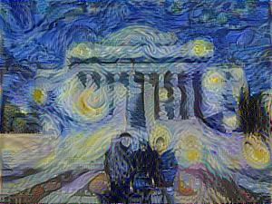 | 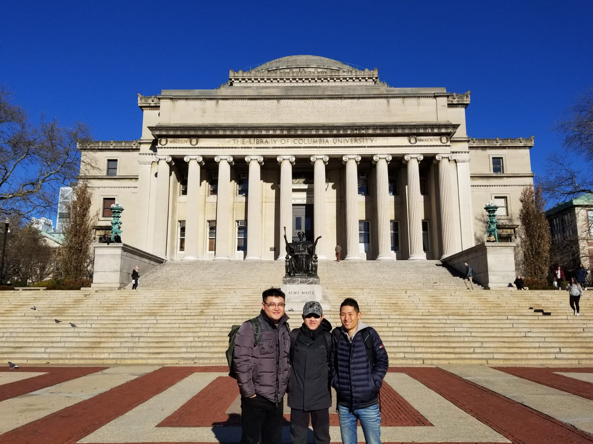 | 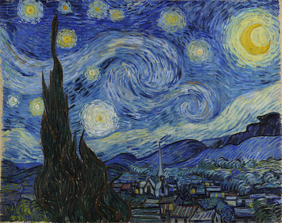

Result | Tubingen |  Starry Night by Vincent van Gogh
:-----:|:--------:|:--------:
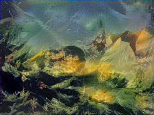 | 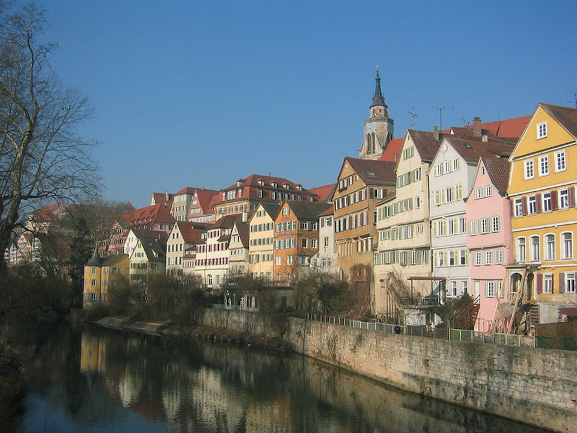 | 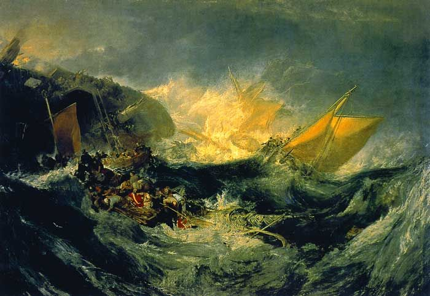

Result | Tubingen |  Starry Night by Vincent van Gogh
:-----:|:--------:|:--------:
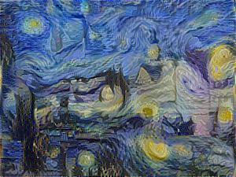 |  | 

Result | Tubingen |  Starry Night by Vincent van Gogh
:-----:|:--------:|:--------:
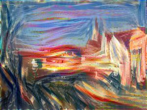 |  | 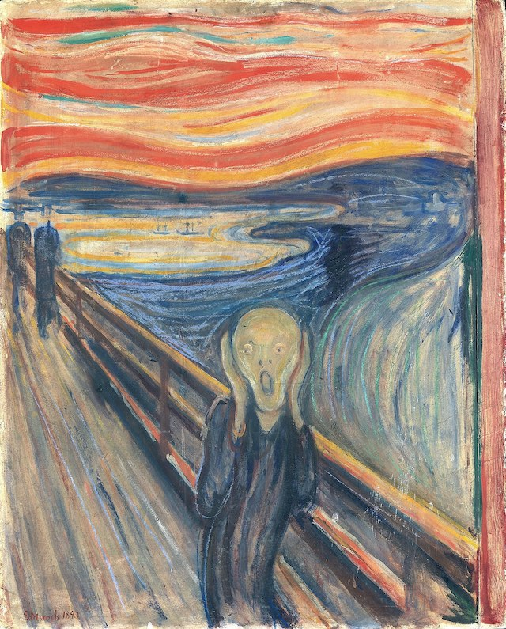

Result | Tubingen |  Starry Night by Vincent van Gogh
:-----:|:--------:|:--------:
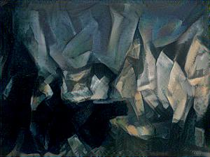 |  | 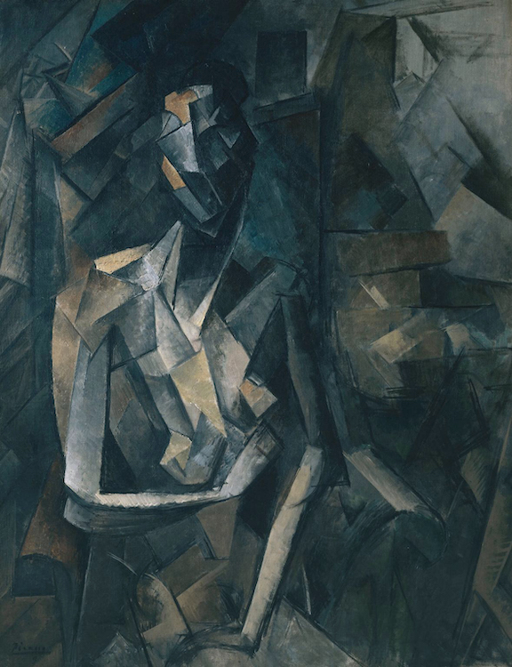

Result | Tubingen |  Starry Night by Vincent van Gogh
:-----:|:--------:|:--------:
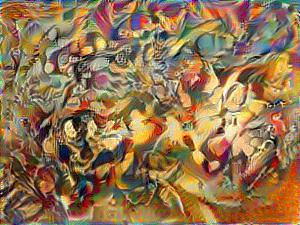 |  | 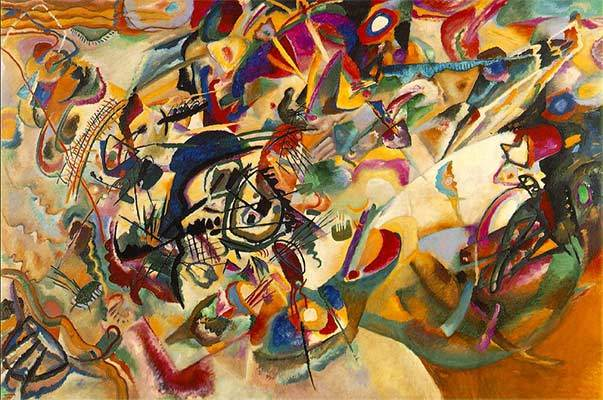

# How to run
You will need to download the pre-trained VGG19 model from [here](https://github.com/machrisaa/tensorflow-vgg) and place it to the root directory of `neural-artistist`.
