# neural-artistist

`neural-artistist` is an implementation of [Image Style Transfer Using Convolutional Neural Networks](https://www.cv-foundation.org/openaccess/content_cvpr_2016/papers/Gatys_Image_Style_Transfer_CVPR_2016_paper.pdf)

# Results

Our team standing in front of Columbia University with the Starry Night by Vincent van Gogh

Result | Our Team | Starry Night
:-----:|:--------:|:--------:
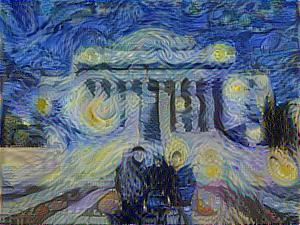 | 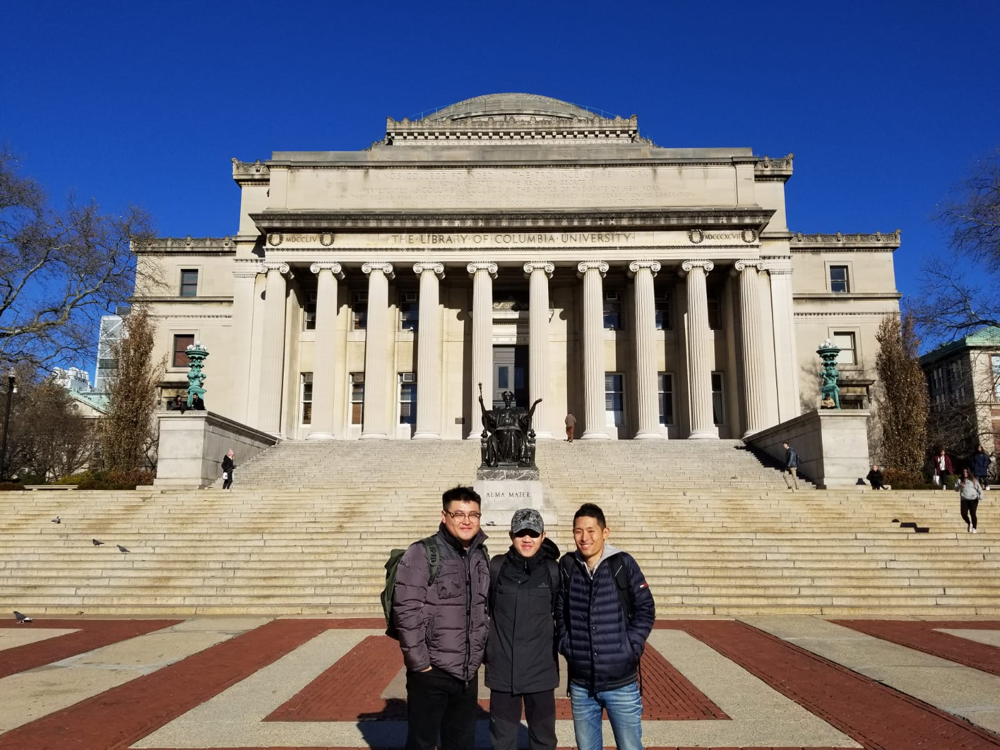 | 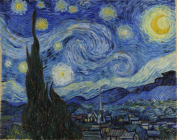

Other results replicating the paper

Result | Tubingen | Shipwreck
:-----:|:--------:|:--------:
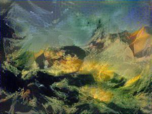 | 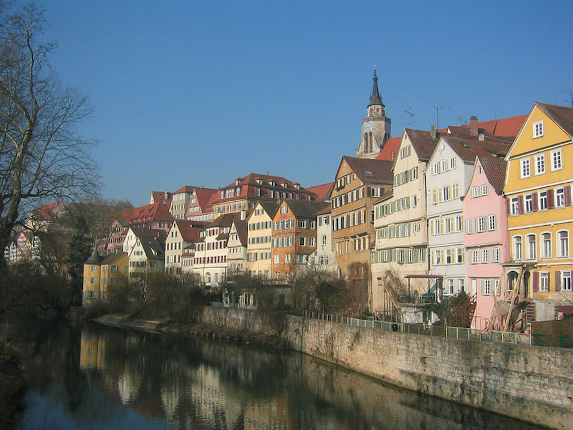 | 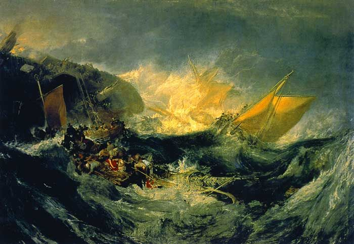

Result | Tubingen | Starry Night
:-----:|:--------:|:--------:
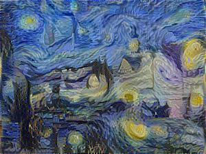 |  | 

Result | Tubingen | Scream
:-----:|:--------:|:--------:
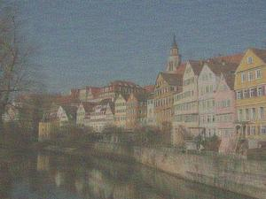 |  | 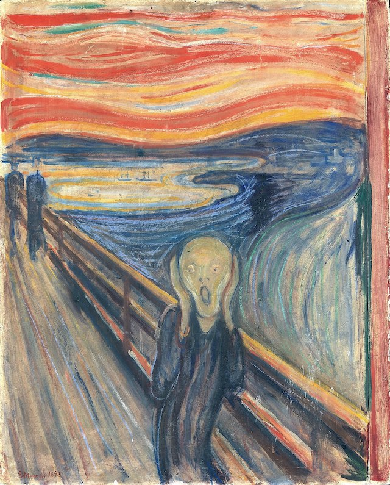

Result | Tubingen | Seated Nude
:-----:|:--------:|:--------:
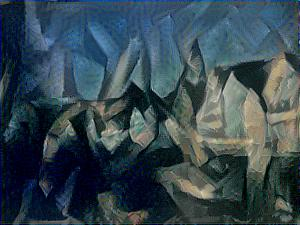 |  | 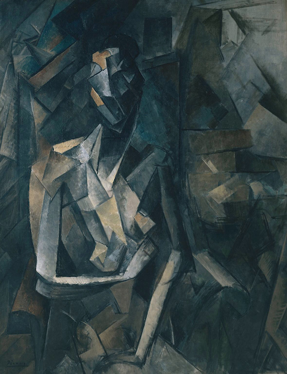

Result | Tubingen | Somposition
:-----:|:--------:|:--------:
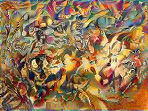 |  | 

# How to run
You will need to download the pre-trained VGG19 model from [here](https://github.com/machrisaa/tensorflow-vgg) and place it to the root directory of `neural-artistist`.

Then apply slyle to a content image by

    import stylize

    content = 'tubingen.jpg'
    style = 'starry_night.jpg'

    stylize.apply(content, style, learning_rate=2.0, iterations=1001,
                  alpha=1, beta=1000, noise_ratio=0.6, new_width=300)
