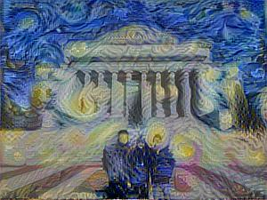
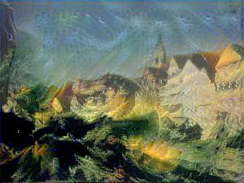
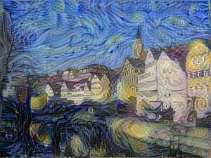
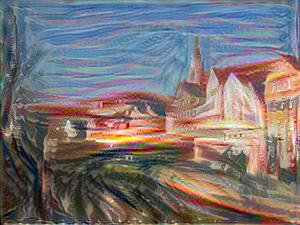
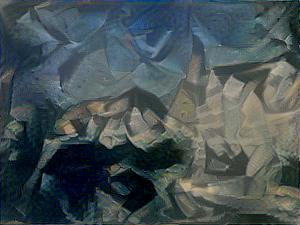
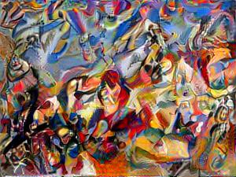

# neural-artistist
Contributors: E.K. Itoku, Sing Pou Lee, Sean Xu, all from Columbia University, School of Engineering

For our Deep Learning class final project, we have independently reproduced the results of [A Neural Algorithm of Artistic Style](https://arxiv.org/pdf/1508.06576.pdf) by Leon A. Gatys, Alexander S. Ecker and Matthias Bethge in 2015.
We also conducted a series of experimentations to obtain deeper insights into deep learning mechanisms for style and content transfer in images.

The above paper was followed by [Image Style Transfer Using Convolutional Neural Networks](https://www.cv-foundation.org/openaccess/content_cvpr_2016/papers/Gatys_Image_Style_Transfer_CVPR_2016_paper.pdf) in 2016 IEEE Conference on Computer Vision and Pattern Recognition, by the same authors.

# How to run

You will need to download the pre-trained VGG19 model, [vgg19.npy](https://drive.google.com/open?id=1dvv0XiR1nmJVO06EdqLcesJoNYqIcPx7) on Google Drive and place it in the root directory of `neural-artistist`.

Then apply style to a content image by

    import stylize

    content = 'tubingen.jpg'
    style = 'shipwreck.jpg'

    stylize.apply(content, style, learning_rate=1.0,iters=100,
                  alpha=1, beta=5, noise_ratio=0.1, new_width=300, pool_method='avg',
                  pool_stride=2, style_loss_layers_w=(0.2, 0.2, 0.2, 0.2, 0.2),
                  style_num_layers=5, content_layer_num=4, optimizer='lbfgs')

Output images will be exported to [outputs](outputs)

# Our results

You can see the code generating these results below in [stylize_image.ipynb](stylize_image.ipynb).

Our team in front of Low Memorial Library, Columbia University, with style transfer from The Starry Night

Result | Our Team | Starry Night
:-----:|:--------:|:--------:
 |  | 

Other results replicating the paper

Result | Content | Style
:-----:|:--------:|:--------:
 |  | 
 |  | 
 |  | 
 |  | 
 |  | 
